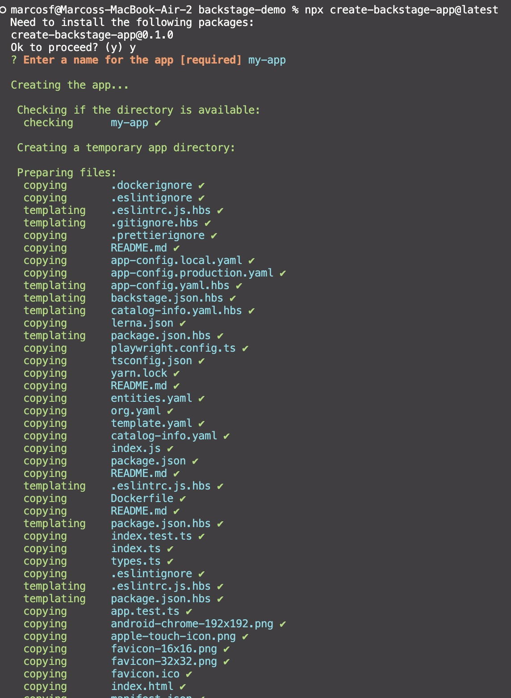
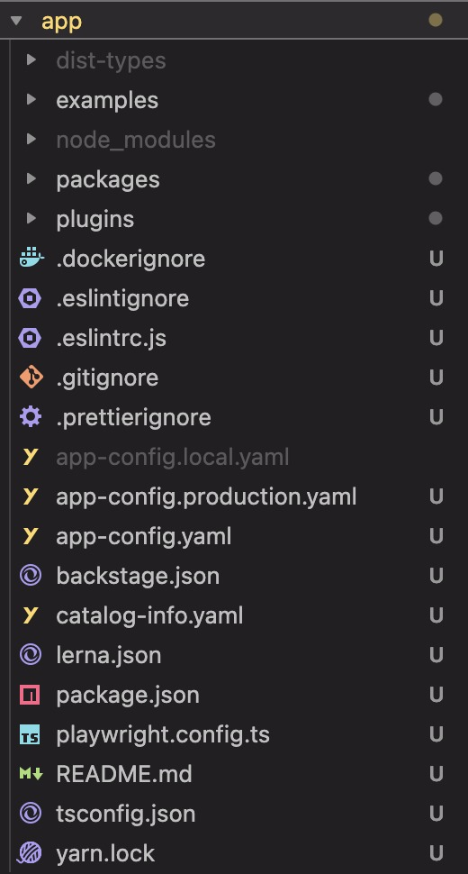
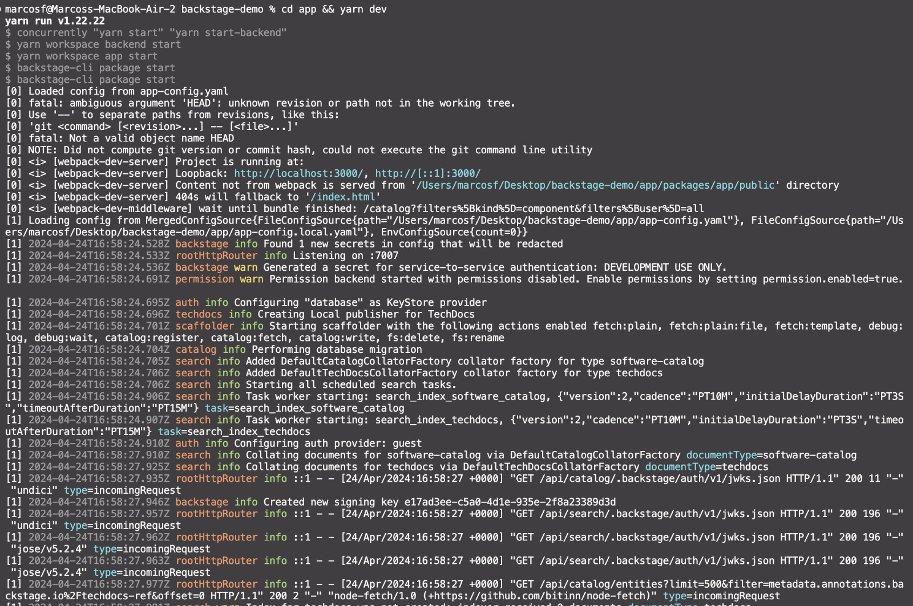
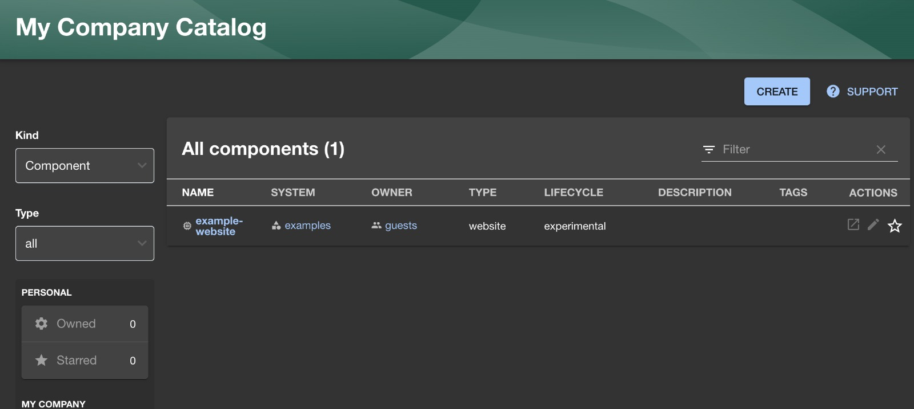

# Documentação do processo de compilação e execução da ferramenta

O processo de compilação e execução da ferramenta é bastante direto e simples e pode ser obtido em https://backstage.io/docs/getting-started/.

O primeiro passo é executar o comando `npx create-backstage-app@latest` para criar um novo projeto Backstage. Em seguida, é necessário navegar até o diretório do projeto e executar o comando `yarn install` para instalar as dependências do projeto (em ambientes Unix, não é necessário executar o comando `yarn install`).

Por fim, é necessário executar o comando `yarn dev` para iniciar o servidor de desenvolvimento.

# Registro do processo (prints)

O processo de compilação e execução da ferramenta foi registrado com prints de tela e pode ser visualizado abaixo.

A imagem abaixo demonstra a arquitetura de arquivos, pastas e diretórios do projeto. O arquivo `package.json` é o arquivo de configuração do projeto e contém informações sobre as dependências do projeto, scripts de execução, entre outras informações.

A imagem abaixo demonstra a execução do comando `yarn dev` para iniciar o servidor de desenvolvimento. O servidor de desenvolvimento é iniciado na porta 3000 e pode ser acessado em http://localhost:3000.

Em caso de dificuldade de visualização das imagens, elas podem ser acessadas diretamente na pasta `assets` deste repositório.

# Evidência da aplicação sendo executada com prints no arquivo markdown

A imagem abaixo demonstra a execução da ferramenta Backstage. O servidor de desenvolvimento foi iniciado com sucesso e a ferramenta está sendo executada na porta 3000.

